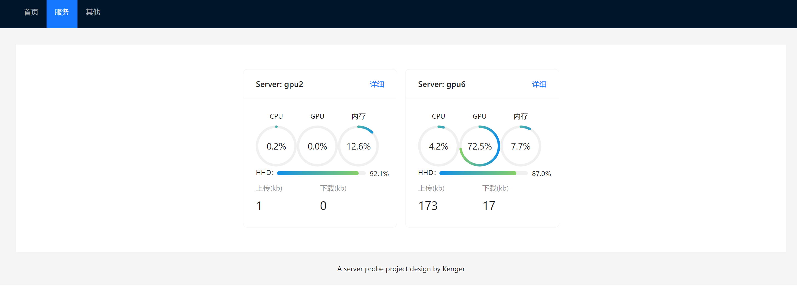
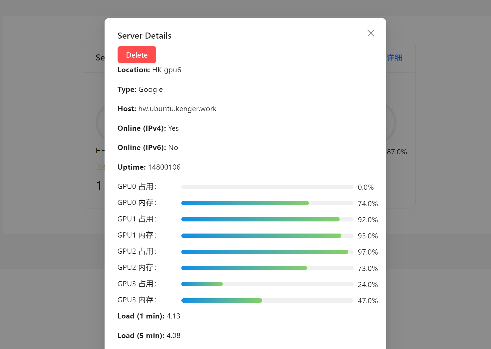
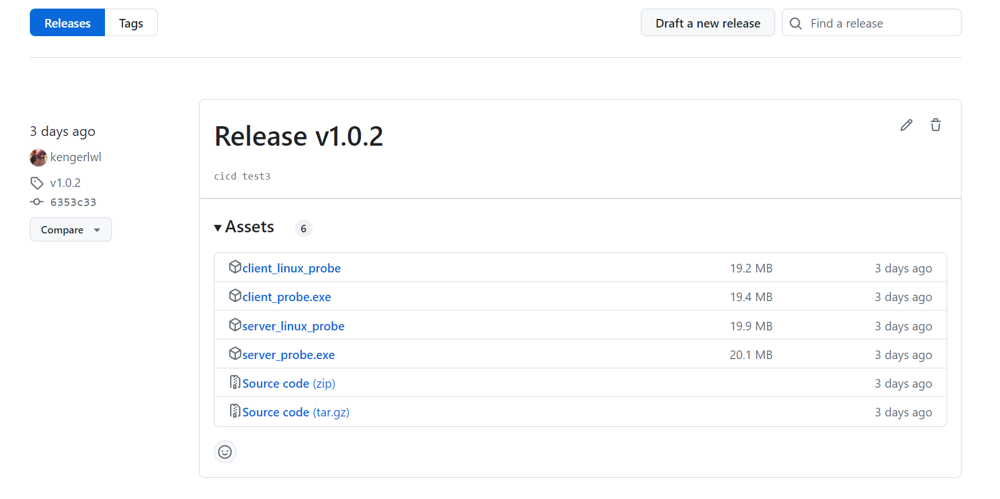

# 介绍

服务器云探针系统，提供可视化界面。

参考了[cppla/ServerStatus](https://github.com/cppla/ServerStatus)的设计思路。

**不同的是，针对实验室的日常使用进行了优化，加入GPU等监控（欢迎大家提意见）。**

基于**go**语言开发，用**Etcd**实现了持久化以及一致性。

针对多个平台进行了打包，提供win64，linux64的运行包。下载即用，非常方便。

运行截图如下：



点击可以查看详细信息



## to do

- 加入下线预警系统


# 如何使用

## 基于可执行文件

### 1.下载相应的可执行文件

点击链接**Release**[Releases · kengerlwl/serverStatus-Go](https://github.com/kengerlwl/serverStatus-Go/releases)



**包括：（请根据自己的需求下载）**

- probe探针

  - linux客户端执行文件（即你需要检测的服务器）

  - win客户端执行exe。（window也可以监控）

- 服务器部署server端
  - 部署在linux上的可视化以及监控系统
  - 部署在win上的可视化以及监控系统


 

### 2.运行etcd键值对系统

可以使用docker等方式来运行。

**参见**

````
```
docker run -d \
    --name etcd \
    -p 2379:2379 \
    -p 2380:2380 \
    quay.io/coreos/etcd:v3.5.0 \
    /usr/local/bin/etcd \
    --advertise-client-urls http://0.0.0.0:2379 \
    --listen-client-urls http://0.0.0.0:2379 \
    --initial-advertise-peer-urls http://0.0.0.0:2380 \
    --listen-peer-urls http://0.0.0.0:2380 \
    --initial-cluster-token etcd-cluster \
    --initial-cluster default=http://0.0.0.0:2380 \
    --initial-cluster-state new
```
````


### 3 编写外部配置

本项目目前用的是json文件配置


**客户端配置：**

新建`para.client.json`文件与可执行文件在同一个目录。

```
{
    "etcd": {  \\ etcd的配置
        "host": "hw.ubuntu.kenger.work",
        "port": "2379"
    },
    "serverName":"kenger-x99", \\ 主机名，需要唯一
    "serverType":"Google",
    "serverHost":"hw.ubuntu.kenger.work",
    "serverLocation":"HK"
}
```


**服务器端配置：**

新建`para.server.json`文件与可执行文件在同一个目录。

```
{
    "etcd": {  \\ etcd的配置
        "host": "hw.ubuntu.kenger.work",
        "port": "2379"
    }
}
```

此外，服务器端，还需要将代码中的`static`目录页拷贝到可执行文件的同一个目录下


## 基于docker全流程部署

未完待续，暂时没有时间做打包，大家有兴趣可以帮忙做一下。


# 相关开源项目 ：


- ServerStatus-Toyo：https://github.com/ToyoDAdoubiBackup/ServerStatus-Toyo MIT License
- ServerStatus：https://github.com/BotoX/ServerStatus WTFPL License
- mojeda's ServerStatus: https://github.com/mojeda/ServerStatus WTFPL License -> GNU GPLv3 License (ServerStatus is a full rewrite of mojeda's ServerStatus script and not affected by GPL)
- BlueVM's project: http://www.lowendtalk.com/discussion/comment/169690#Comment_169690 WTFPL License

- [cokemine/ServerStatus-Hotaru: 云探针、多服务器探针、云监控、多服务器云监控](https://github.com/cokemine/ServerStatus-Hotaru)